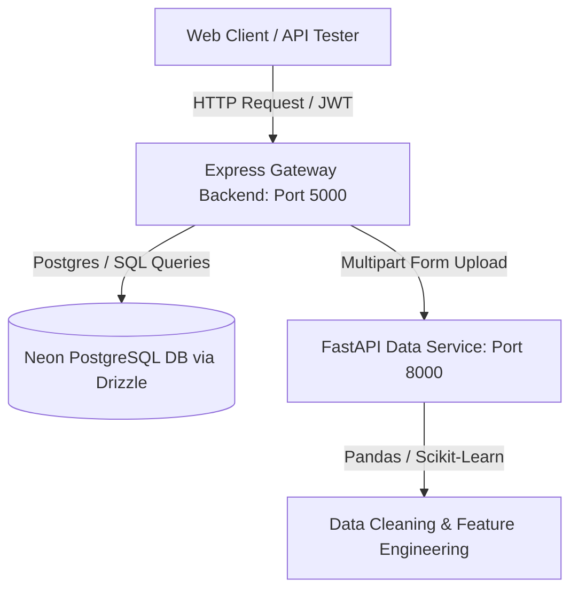

# 📊 Data Pre-Processor

A modern, full-stack data preprocessing system designed to clean, analyze, and prepare raw tabular data (CSV) for machine learning workflows. It uses a **microservice architecture** consisting of a TypeScript Express gateway backend for user management/file handling and a Python FastAPI computation service for high-performance data processing.

---

## 🚀 System Architecture



1. **Express Gateway Backend (TypeScript & Node.js)**
   - Manages user authentication (JWT-based registration, login, and logout).
   - Handles file upload limits (restricted to 2MB CSVs) and routes validation.
   - Forwards valid files to the Python computation service and returns structured JSON reports.
   - Configured with **Drizzle ORM** for database interaction on **Neon PostgreSQL**.

2. **Data Processing Microservice (Python & FastAPI)**
   - Exposes a high-performance HTTP endpoint for processing CSV files.
   - Built using **FastAPI**, **Pandas**, **Numpy**, and **Scikit-Learn**.
   - Generates detailed reports containing dataset statistics, missing values, duplicates, outliers, and type classifications alongside the fully cleaned and encoded dataset.

---

## 🛠️ Tech Stack

### Backend Gateway (`/backend`)
- **Runtime & Language:** Node.js (v20+ recommended), TypeScript
- **Framework:** Express.js (v5)
- **Database ORM:** Drizzle ORM with `@neondatabase/serverless` (PostgreSQL)
- **Authentication:** JSON Web Tokens (`jsonwebtoken`), Password Hashing (`bcrypt`)
- **File Handling:** `multer` (for multi-part file uploads)
- **HTTP Client:** `axios` (for microservice communication)

### Data Service (`/data-service`)
- **Language:** Python >= 3.13
- **Framework:** FastAPI
- **Web Server:** Uvicorn
- **Data Science Libraries:** Pandas, NumPy, Scikit-Learn (for encoding and processing)
- **Package Manager:** `uv` (recommended) or `pip`

---

## ⚙️ Features & Processing Pipeline

When a CSV is uploaded and processed, the **Data Service** applies the following operations:

1. **Shape Analysis:** Counts total rows and columns in the raw dataset.
2. **Missing Value Imputation:**
   - **Numeric Columns:** Missing values are filled using the **median** (robust to outliers).
   - **Categorical Columns:** Missing values are filled with the **mode** (most frequent value), falling back to `"Unknown"`.
   - Generates a report showing missing counts and percentages per column.
3. **Duplicate Removal:** Automatically detects and removes duplicate rows from the dataset.
4. **Column Type Classification:** Groups columns into `numeric` or `categorical`.
5. **Outlier Detection:** Uses the **Interquartile Range (IQR)** method ($Q1 - 1.5 \times IQR$ to $Q3 + 1.5 \times IQR$) to identify the count and bounds of outliers in all numeric columns.
6. **Feature Encoding:** Automatically converts categorical columns into numerical values using Scikit-Learn's `LabelEncoder` and returns the exact mapping index dictionary.
7. **Summary Statistics:** Generates standard statistical descriptions (mean, std, min, quartiles, max) for cleaned numeric columns.
8. **Data Preview:** Outputs a preview of the first 10 rows of processed/encoded data alongside the full cleaned dataset.

---

## 🔑 API Endpoints

### 1. Authentication (Gateway)
- `POST /api/auth/register` - Create a new user account (`name`, `email`, `password`).
- `POST /api/auth/login` - Authenticate and receive a session JWT.
- `POST /api/auth/logout` - Invalidate/destroy session.

### 2. Data Processing (Gateway - Protected)
- `POST /api/file/upload` - Securely uploads a CSV file (validation only).
- `POST /api/file/process` - Uploads, validates, cleanses, encodes, and returns the preprocessed dataset payload and analysis report.

### 3. Data Service (Internal/Direct)
- `POST /data-service/process` - Directly accepts a CSV file and runs the preprocessing engine.

---

## 📦 Getting Started

### Prerequisites
- Node.js (v20+)
- Python 3.13+
- A PostgreSQL connection string (e.g., Neon database)

### Setup Backend Gateway
1. Navigate to `/backend`.
2. Create your `.env` file from the example:
   ```bash
   cp .env.example .env
   ```
3. Populate your `.env` variables:
   - `DATABASE_URL`: Your PostgreSQL connection string.
   - `JWT_SECRET`: A secure key for token signing.
4. Install dependencies:
   ```bash
   npm install
   ```
5. Apply database migrations:
   ```bash
   npx drizzle-kit push
   ```
6. Start the development server:
   ```bash
   npm run dev
   ```
   *The Gateway server will start on http://localhost:5000 (or custom configured port).*

### Setup Data Service
1. Navigate to `/data-service`.
2. Install Python dependencies (using `uv` is highly recommended for speed):
   ```bash
   uv sync
   ```
   *Or using a virtual environment:*
   ```bash
   python -m venv .venv
   source .venv/bin/activate  # On Windows: .venv\Scripts\activate
   pip install -r requirements.txt
   ```
3. Start the FastAPI microservice:
   ```bash
   uv run main.py
   ```
   *Or directly via Uvicorn:*
   ```bash
   uvicorn app:app --host 0.0.0.0 --port 8000 --reload
   ```
   *The microservice will run on http://localhost:8000.*

---

## 🧪 Testing the API

You can test the processing pipeline using the `sample_test.csv` provided in the root directory.

### Quick cURL Test (Direct to Data Service)
```bash
curl -X POST -F "file=@sample_test.csv" http://localhost:8000/data-service/process
```

---

## 📄 License
This project is licensed under the ISC License.
